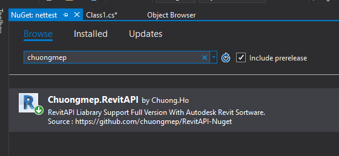
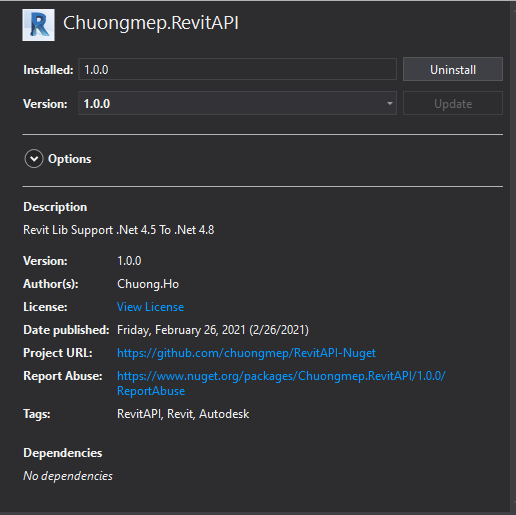

# RevitAPI-Nuget


[](https://opensource.org/licenses/MIT)
<a href="https://twitter.com/intent/follow?screen_name=chuongmep">
        </a>
            
RevitAPI Framework Support Full Version Support CI/CD Automatic In Github

### NuGet packages

```
Install-Package Chuongmep.RevitAPI -Version 1.0.0
```
|Revit Version   | .Net Farmwork Version  |
|:-|:-|
|  Revit 2015 | .Net 4.5  |
|  Revit 2016 | .Net 4.5  |
|  Revit 2017 | .Net 4.6.2  |
|  Revit 2018 | .Net 4.6.2  |
|  Revit 2019 | .Net 4.7.2  |
|  Revit 2020 | .Net 4.7.2  |
|  Revit 2021 | .Net 4.8  |

### Library Include

- [X] AdWindows.dll
- [X] RevitAddInUtility.dll
- [X] RevitAPI.dll
- [X] RevitAPIUI.dll
- [X] RevitAPIIFC.dll
- [X] RevitAPIMacros.dll
- [X] RevitAPIUIMacros.dll
- [X] UIFramework.dll

Manual : Search Chuongmep in nuget package manager



Install/Reinstall Package



### .NET CLI

```
dotnet add package Chuongmep.RevitAPI --version 1.0.0
```
### PackageReference

For projects that support PackageReference, copy this XML node into the project file to reference the package.

```
<PackageReference Include="Chuongmep.RevitAPI" Version="1.0.0" />
```

### Paket CLI

```
paket add Chuongmep.RevitAPI --version 1.0.0
```

The NuGet Team does not provide support for this client. Please contact its maintainers for support.

### F# Interactive

```
#r "nuget: Chuongmep.RevitAPI, 1.0.0"
```

### Log Change

#### V1.0.0 : First Release
